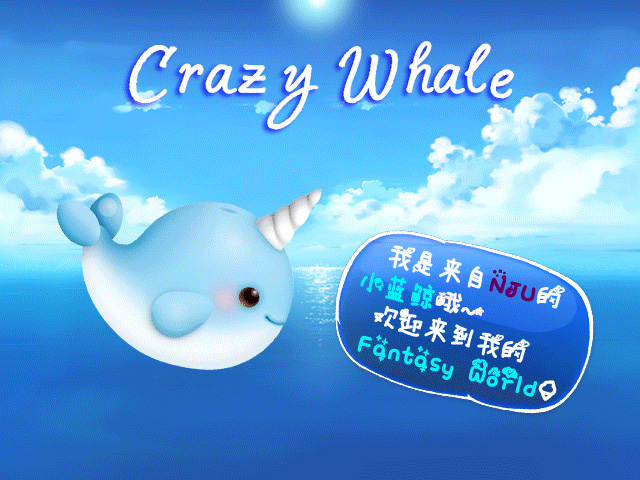
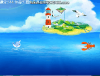

# Crazy Whale —— 疯狂的小蓝鲸
  
An Independent Parkour Game based on easyx & C  

## Demo
  

## 程序功能
* 《Crazy Whale》是一款以南大吉祥物“小蓝鲸”为主角的跑酷游戏。本游戏通过操作“w”“s”或“↑”“↓”控制小蓝鲸上浮下潜以躲避海底障碍物，在水面上时按“空格键”可以让小蓝鲸跳跃以越过岛屿，游戏过程中小蓝鲸存活时间越久得分越高。与此同时，小蓝鲸吃到鱼可以获得加分或者无敌的奖励。难度方面共设计了四个难度，难度乘以时间决定最终的总分。除了游戏部分之外，玩家还可以查看规则及团队介绍。
* 本程序设计灵感来源于《flappy bird》，但实际上程序设计思路完全是团队原创。玩家在游戏中还能发现许多亮点，如千奇百怪的障碍物、奖励设置、跳跃操作、小蓝鲸吐槽等，界面精美，可玩性高，是一款操作简易娱乐性强的游戏。
## 组员分工
### 岳翔
Crazy Whale团队负责人，游戏总策划，主框架设计者。主要完成游戏部分代码实现。程序设计中解决的问题有：透明贴图绘制、结构体封装、坐标测量、文本输出、物体移动、随机障碍、奖励设置、按键捕捉、音乐导入。美工方面，解决的问题有：补码图绘制、图片信息记录。
### 芮雨琛
Crazy Whale美术总策划，负责所有场景、角色、障碍物、音效及版面的设计与制作，参与玩家主界面及各种动态效果的构思与实现，对制作进程中的细节进行发掘和处理。
### 吴昊
负责部分功能的实现，主要包括碰撞的检测和判定、跳跃、游戏结束后的选择、最高分记录、多生命功能的实现；早期头文件的编写，主界面和游戏部分的黏合。
## 数据结构
本程序主要使用了Whale、Rect、Bonus结构体和wImg、wImgx数组.
## 调试主要问题及思考
1. 透明贴图：因为物体绘制时需要去掉背景，所以如何实现透明贴图成了一大难题，最初是想通过导入Png实现，发现easyx不支持Png且只支持Bmp与Jpg格式。之后又从网上下载easyx第三方Png支持库，结果安装失败。最后通过绘制补码图和原图实现了透明贴图。
2. 随机障碍：一开始打算通过人工导入地图的方式来绘制地图，但发现数据不好处理，因此采用了随机算法每个一段时间生成障碍。在最初的Demo版本里，出现了随机物体组合导致小蓝鲸无法通过的情况，因为是纯随机生成，所以通过检测随机数以防出现通不过的障碍组合避免了该问题。
3. 操作捕捉：小蓝鲸移动过程中会出现“先动一下，再缓缓移动”的情况，也就是动作不流畅的问题。这一问题是由于使用getch()来捕捉按键导致的，getch()获取输入存在系统给定的0.5毫秒的间隔。之后我们实现了用GetAsyncKeystate解决了该问题，实现了平滑移动。与此同时还有一个问题是，玩家按住某一个键小蓝鲸会一直移动下去，灵敏度很高，之后我们设置了“按下并弹起”的条件，这样小蓝鲸的动作更加易于控制。
4. 移动问题：物体移动是游戏的一大难题，在最初物体移动是通过坐标自增减实现的，但物体的速度是通过Sleep控制的并且不稳定不直观。之后我们通过获取系统时间来测量间隔时间，据此计算出物体坐标，实现了物体更精确的移动。
5. 碰撞判定：物体碰撞需要知道坐标、长、宽三个量，而这和图片大小密切相关。我们游戏图片都是矩形，碰撞检测也以矩形为判定，如果物体的轮廓不接近矩形就会有很奇怪的碰撞判定，于是芮雨琛同学把物体做的更像矩形，缓解了该问题。
6. 图形移动过程中前一刻图像未擦除导致重复出现，在循环移动过程中不断覆盖背景图片以营造擦除效果；界面切换时鼠标不断获取信息进行判断，造成界面2的信息放到了界面1使用判断条件下，导致判断错误，界面切换乱套，在程序中放入多个goto结构使得信息去往正确的位置。
7. 跳跃功能：在实现跳跃功能时直接使用岳翔在物体移动中的相关函数会出现一些逻辑性和变量重复的问题，通过编写新的专用于跳跃判定的函数解决了这个问题。其他没有遇到问题。
